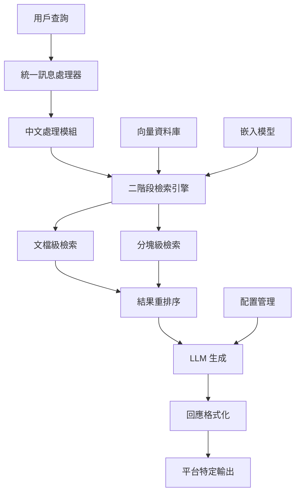

# RAGASSERVICE - 企業級中文 RAG 系統

<div align="center">


以 **RAGIE** 為標竿的高品質檢索增強生成系統，專注於中文優化和 LINE/WhatsApp 整合。

[功能特色](#-功能特色) • [快速開始](#-快速開始) • [文檔](#-文檔) • [貢獻](#-貢獻)

</div>

## 🎯 項目目標

- **🔍 多階段檢索**：建構穩定的二/三階段檢索系統，達到 RAGIE 85-95% 性能水準
- **🇹🇼 中文優化**：實現優異的中文語言處理能力，支援繁簡體自動轉換
- **💬 平台整合**：深度整合 LINE 和 WhatsApp 平台，提供無縫對話體驗
- **🚀 企業級**：提供可擴展、高可用的企業級部署方案

## ✨ 功能特色

### 🧠 核心 RAG 能力
- **多模態處理**：支援文字、圖片、音頻、PDF 等多種格式
- **智能分塊**：語義感知的文檔分塊策略
- **向量檢索**：基於 Qdrant 的高性能向量搜索
- **重排序**：LLM 輔助的智能結果重排序

### 🇹🇼 中文特化
- **分詞優化**：專業術語分詞準確處理
- **繁簡轉換**：自動繁簡體轉換和處理
- **語義理解**：針對中文語境的語義理解增強
- **專業詞彙**：支援領域專業詞彙庫

### 💬 通訊平台整合
- **LINE Bot**：Rich Message、Quick Reply、Flex Message 支援
- **WhatsApp Business**：互動式按鈕、媒體訊息、範本訊息
- **統一介面**：跨平台的統一訊息處理架構

### ⚙️ 靈活模型配置
- **多模型支援**：OpenAI、Anthropic、Google、本地模型
- **智能調度**：基於成本和性能的智能模型選擇
- **API 金鑰管理**：安全的用戶自定義 API 金鑰管理

## 🚀 快速開始

### 前置需求
- Python 3.9+
- Docker & Docker Compose
- Git

### 安裝與執行

```bash
# 1. 克隆倉庫
git clone https://github.com/stevechen1112/RAGASSERVICE.git
cd RAGASSERVICE

# 2. 使用 Docker Compose 啟動所有服務
docker-compose up -d

# 3. 檢查服務狀態
docker-compose ps

# 4. 查看日誌
docker-compose logs -f ragasservice
```

### 本地開發環境

```bash
# 1. 創建虛擬環境
python -m venv venv
source venv/bin/activate  # Windows: venv\Scripts\activate

# 2. 安裝依賴
pip install -r requirements.txt

# 3. 設置環境變數
cp config/development.yaml.example config/development.yaml
# 編輯 config/development.yaml 填入您的 API 金鑰

# 4. 啟動開發服務器
uvicorn src.api.main:app --reload --host 0.0.0.0 --port 8000
```

### API 使用範例

```python
import requests

# 基本 RAG 查詢
response = requests.post(
    "http://localhost:8000/api/v1/query",
    json={
        "query": "什麼是檢索增強生成？",
        "language": "zh-TW",
        "max_results": 5
    }
)

print(response.json())
```

## 📋 開發階段

我們採用分階段開發策略，確保每個階段都有可交付的成果：

| 階段 | 時程 | 主要目標 | 狀態 |
|------|------|----------|------|
| **第一階段** | 2024年 | 基礎 RAG 系統建立 | 🔄 進行中 |
| **第二階段** | 2025年 | 平台整合深化 | ⏳ 待開始 |
| **第三階段** | 2026年 | 多模態處理能力 | ⏳ 待開始 |
| **第四階段** | 2027年 | 三階段檢索優化 | ⏳ 待開始 |
| **第五階段** | 2028年 | 企業級部署 | ⏳ 待開始 |

## 🏗️ 架構概覽



## 📖 文檔

- 📋 [開發計畫](docs/development_plan.md) - 完整的五階段開發計畫
- 📊 [進度追蹤](docs/progress_tracker.md) - 詳細的開發進度追蹤
- 🔧 [API 文檔](docs/api/) - RESTful API 使用指南
- 🏗️ [架構設計](docs/architecture/) - 系統架構說明
- 👥 [用戶指南](docs/user_guide/) - 使用者操作手冊

## 🧪 測試

```bash
# 執行所有測試
pytest

# 執行特定類型的測試
pytest src/tests/unit/          # 單元測試
pytest src/tests/integration/   # 整合測試
pytest src/tests/e2e/          # 端到端測試

# 生成覆蓋率報告
pytest --cov=src --cov-report=html
```

## 🚀 部署

### Docker 部署
```bash
# 生產環境部署
docker-compose -f docker-compose.prod.yml up -d
```

### Kubernetes 部署
```bash
# 應用 Kubernetes 配置
kubectl apply -f deployment/kubernetes/
```

## 🤝 貢獻

我們歡迎所有形式的貢獻！請查看我們的 [貢獻指南](CONTRIBUTING.md) 了解如何參與。

### 開發流程
1. Fork 此倉庫
2. 創建功能分支 (`git checkout -b feature/amazing-feature`)
3. 提交更改 (`git commit -m 'Add some amazing feature'`)
4. 推送到分支 (`git push origin feature/amazing-feature`)
5. 開啟 Pull Request

### 代碼規範
- 使用 `black` 進行代碼格式化
- 使用 `flake8` 進行代碼檢查
- 使用 `mypy` 進行類型檢查
- 維持 90%+ 的測試覆蓋率

## 📊 項目狀態

- **總預算**：NT$ 65,000,000
- **開發週期**：60個月（5年）
- **團隊規模**：20-25人
- **當前階段**：第一階段（基礎系統建立）
- **目標性能**：達到 RAGIE 85-95% 水準

## 🏷️ 技術棧

### 後端
- **框架**：FastAPI, Uvicorn
- **資料庫**：PostgreSQL, Redis, Qdrant
- **AI/ML**：LangChain, OpenAI, Anthropic
- **中文處理**：jieba, zhconv

### 整合
- **通訊平台**：LINE Bot SDK, WhatsApp Business API
- **容器化**：Docker, Docker Compose
- **編排**：Kubernetes
- **監控**：Prometheus, Grafana

### 開發工具
- **測試**：pytest, pytest-cov
- **代碼品質**：black, flake8, mypy
- **CI/CD**：GitHub Actions

## 📄 許可證

本項目採用 MIT 許可證。詳情請參閱 [LICENSE](LICENSE) 文件。

## 📞 聯繫我們

- **項目維護者**：Steve Chen
- **Email**：stevechen1112@example.com
- **GitHub**：[@stevechen1112](https://github.com/stevechen1112)

## 🙏 致謝

感謝所有為此項目做出貢獻的開發者和社區成員。

---

<div align="center">

**[⬆ 回到頂部](#ragasservice---企業級中文-rag-系統)**

Made with ❤️ by the RAGASSERVICE Team

</div> 