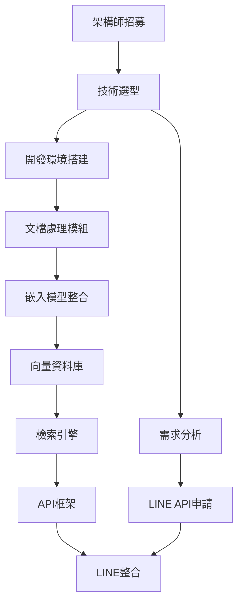

# RAG 系統開發進度追蹤表

## 📊 項目總覽

**項目名稱**：以 Ragie 為標竿的高品質 RAG 系統  
**開始日期**：2024年1月  
**預計完成**：2028年12月  
**總預算**：NT$ 65,000,000  
**當前階段**：第一階段（基礎 RAG 系統建立）  
**整體進度**：0% 完成

---

## 🎯 五階段進度概覽

| 階段 | 時程 | 預算 | 狀態 | 進度 | 風險等級 |
|------|------|------|------|------|----------|
| 第一階段 | 2024/01-2024/12 | NT$ 8,000,000 | 🔄 進行中 | 0% | 🟡 中等 |
| 第二階段 | 2025/01-2025/12 | NT$ 10,000,000 | ⏳ 待開始 | 0% | 🟡 中等 |
| 第三階段 | 2026/01-2026/12 | NT$ 12,000,000 | ⏳ 待開始 | 0% | 🟠 較高 |
| 第四階段 | 2027/01-2027/12 | NT$ 15,000,000 | ⏳ 待開始 | 0% | 🔴 高 |
| 第五階段 | 2028/01-2028/12 | NT$ 20,000,000 | ⏳ 待開始 | 0% | 🟡 中等 |

---

## 📋 第一階段：基礎 RAG 系統建立（2024年）

### **階段目標**
- [x] 建立穩定的二階段檢索系統
- [x] 實現基本的中文優化
- [x] 完成 LINE 平台基礎整合
- [x] 達到 RAGIE 85% 性能水準

### **月度里程碑追蹤**

#### **第1季度（2024/01-03）：團隊建立與技術選型**

##### **1.1 核心團隊招募（2024/01/01-01/31）**
| 子任務 | 負責人 | 預計完成 | 實際完成 | 狀態 | 交付物 | 驗收標準 |
|--------|--------|----------|----------|------|--------|----------|
| 職位需求分析 | HR主管 | 2024/01/05 | - | ⏳ 待開始 | 職位描述文件 | 6個職位JD完成 |
| 招募渠道建立 | HR主管 | 2024/01/08 | - | ⏳ 待開始 | 招募計畫 | 至少5個招募渠道 |
| RAG架構師面試 | 技術總監 | 2024/01/15 | - | ⏳ 待開始 | 面試評估報告 | 至少3個候選人 |
| 後端工程師招募 | 技術總監 | 2024/01/25 | - | ⏳ 待開始 | 錄取通知 | 3名後端工程師到位 |
| AI/ML工程師招募 | 技術總監 | 2024/01/30 | - | ⏳ 待開始 | 錄取通知 | 2名AI工程師到位 |
| 團隊入職培訓 | HR+技術總監 | 2024/01/31 | - | ⏳ 待開始 | 培訓記錄 | 核心團隊6人到位 |

**依賴關係**：架構師招募 → 其他技術人員招募  
**風險點**：🔴 架構師難找，可能延遲整個招募進程

##### **1.2 技術棧確定（2024/02/01-02/15）**
| 子任務 | 負責人 | 預計完成 | 實際完成 | 狀態 | 交付物 | 驗收標準 |
|--------|--------|----------|----------|------|--------|----------|
| RAG框架評估 | 架構師 | 2024/02/03 | - | ⏳ 待開始 | 技術評估報告 | 3個框架對比分析 |
| 嵌入模型選型 | AI工程師A | 2024/02/05 | - | ⏳ 待開始 | 模型測試報告 | BGE-M3 vs 其他模型 |
| 向量資料庫選型 | 架構師 | 2024/02/08 | - | ⏳ 待開始 | 資料庫評估 | Qdrant vs Weaviate vs Pinecone |
| 後端框架確定 | 後端工程師A | 2024/02/10 | - | ⏳ 待開始 | 框架選擇報告 | FastAPI vs Django vs Flask |
| 雲端平台選擇 | DevOps | 2024/02/12 | - | ⏳ 待開始 | 平台對比報告 | AWS vs GCP vs Azure |
| 技術棧文檔 | 架構師 | 2024/02/15 | - | ⏳ 待開始 | 技術架構文檔 | 完整技術棧規格書 |

**依賴關係**：架構師到位 → 技術評估 → 最終決策  
**風險點**：🔴 技術選型錯誤可能需要後期重構，建議延長評估時間

##### **1.3 開發環境搭建（2024/02/16-02/28）**
| 子任務 | 負責人 | 預計完成 | 實際完成 | 狀態 | 交付物 | 驗收標準 |
|--------|--------|----------|----------|------|--------|----------|
| K8s集群部署 | DevOps工程師A | 2024/02/20 | - | ⏳ 待開始 | 集群配置 | 3節點集群運行 |
| CI/CD流程建立 | DevOps工程師B | 2024/02/22 | - | ⏳ 待開始 | Pipeline配置 | 自動化部署流程 |
| 開發工具配置 | 全體開發者 | 2024/02/24 | - | ⏳ 待開始 | 開發環境 | IDE、Git、Docker設置 |
| 監控系統部署 | DevOps工程師A | 2024/02/26 | - | ⏳ 待開始 | 監控面板 | Grafana + Prometheus |
| 測試環境驗證 | QA工程師 | 2024/02/28 | - | ⏳ 待開始 | 環境測試報告 | 所有環境可用 |

**依賴關係**：雲端平台確定 → 集群部署 → 工具配置  
**風險點**：🟡 環境配置複雜，可能影響開發進度

##### **1.4 需求分析完成（2024/03/01-03/15）**
| 子任務 | 負責人 | 預計完成 | 實際完成 | 狀態 | 交付物 | 驗收標準 |
|--------|--------|----------|----------|------|--------|----------|
| 用戶故事收集 | 產品經理 | 2024/03/05 | - | ⏳ 待開始 | 用戶故事地圖 | 50+個用戶故事 |
| 功能規格書撰寫 | 產品經理 | 2024/03/08 | - | ⏳ 待開始 | PRD文檔 | 詳細功能規格 |
| API介面設計 | 架構師 | 2024/03/10 | - | ⏳ 待開始 | API規格書 | OpenAPI 3.0規格 |
| 資料庫設計 | 資料庫專家 | 2024/03/12 | - | ⏳ 待開始 | 資料庫schema | ER圖和建表腳本 |
| 需求評審會議 | 全團隊 | 2024/03/15 | - | ⏳ 待開始 | 評審記錄 | 所有需求確認 |

**依賴關係**：團隊到位 → 需求分析 → 設計評審  
**風險點**：🟡 需求不明確可能導致返工

##### **1.5 LINE API 申請（2024/03/16-03/31）**
| 子任務 | 負責人 | 預計完成 | 實際完成 | 狀態 | 交付物 | 驗收標準 |
|--------|--------|----------|----------|------|--------|----------|
| LINE開發者帳號申請 | LINE專家A | 2024/03/18 | - | ⏳ 待開始 | 開發者帳號 | 帳號審核通過 |
| Bot Channel創建 | LINE專家A | 2024/03/20 | - | ⏳ 待開始 | Channel設置 | 取得Access Token |
| Webhook URL設置 | LINE專家B | 2024/03/22 | - | ⏳ 待開始 | Webhook配置 | 接收訊息測試通過 |
| 基礎Bot測試 | LINE專家B | 2024/03/25 | - | ⏳ 待開始 | 測試報告 | Echo Bot正常運作 |
| 權限和配額確認 | LINE專家A | 2024/03/31 | - | ⏳ 待開始 | 權限文檔 | API使用限制明確 |

**依賴關係**：開發環境 → API申請 → 基礎測試  
**風險點**：🟢 LINE API政策變更風險較低

---

#### **第2季度（2024/04-06）：核心系統開發**

##### **2.1 文檔處理模組（2024/04/01-04/30）**
| 子任務 | 負責人 | 預計完成 | 實際完成 | 狀態 | 交付物 | 驗收標準 |
|--------|--------|----------|----------|------|--------|----------|
| PDF解析器開發 | 後端工程師A | 2024/04/08 | - | ⏳ 待開始 | PDF解析模組 | 支援文字、表格、圖片 |
| Word文檔處理 | 後端工程師A | 2024/04/12 | - | ⏳ 待開始 | Word解析模組 | .docx格式完整支援 |
| 文檔格式檢測 | 後端工程師B | 2024/04/15 | - | ⏳ 待開始 | 格式檢測器 | 自動識別文檔類型 |
| 文本清理和預處理 | 後端工程師B | 2024/04/20 | - | ⏳ 待開始 | 預處理管道 | 去除雜訊、格式化 |
| 批次處理功能 | 後端工程師A | 2024/04/25 | - | ⏳ 待開始 | 批次處理API | 支援大量文檔處理 |
| 單元測試和整合測試 | QA工程師 | 2024/04/30 | - | ⏳ 待開始 | 測試報告 | 95%+測試覆蓋率 |

**依賴關係**：技術棧確定 → 模組開發 → 測試驗證  
**風險點**：🟡 複雜文檔格式可能處理困難

##### **2.2 中文嵌入模型整合（2024/05/01-05/15）**
| 子任務 | 負責人 | 預計完成 | 實際完成 | 狀態 | 交付物 | 驗收標準 |
|--------|--------|----------|----------|------|--------|----------|
| BGE-M3模型部署 | AI工程師A | 2024/05/03 | - | ⏳ 待開始 | 模型服務 | 模型API正常運行 |
| 嵌入向量生成測試 | AI工程師A | 2024/05/06 | - | ⏳ 待開始 | 測試結果 | 中文語義理解準確 |
| 批次嵌入處理 | AI工程師B | 2024/05/08 | - | ⏳ 待開始 | 批次處理API | 支援大量文本嵌入 |
| 嵌入快取機制 | 後端工程師C | 2024/05/10 | - | ⏳ 待開始 | 快取系統 | Redis快取實現 |
| 性能優化 | AI工程師A | 2024/05/12 | - | ⏳ 待開始 | 優化報告 | 處理速度提升30% |
| 嵌入品質評估 | AI工程師B | 2024/05/15 | - | ⏳ 待開始 | 品質報告 | 語義相似度測試通過 |

**依賴關係**：模型選型 → 部署 → 性能優化  
**風險點**：🟡 模型性能可能不符預期

##### **2.3 向量資料庫部署（2024/05/16-05/31）**
| 子任務 | 負責人 | 預計完成 | 實際完成 | 狀態 | 交付物 | 驗收標準 |
|--------|--------|----------|----------|------|--------|----------|
| Qdrant集群搭建 | DevOps工程師A | 2024/05/18 | - | ⏳ 待開始 | 資料庫集群 | 3節點高可用集群 |
| 索引結構設計 | 資料庫專家 | 2024/05/20 | - | ⏳ 待開始 | 索引配置 | 針對RAG優化的索引 |
| 資料導入工具 | 後端工程師B | 2024/05/23 | - | ⏳ 待開始 | 導入腳本 | 批次向量導入功能 |
| 查詢性能調優 | 資料庫專家 | 2024/05/26 | - | ⏳ 待開始 | 調優報告 | 查詢延遲<100ms |
| 備份和恢復機制 | DevOps工程師B | 2024/05/29 | - | ⏳ 待開始 | 備份策略 | 自動化備份流程 |
| 負載測試 | QA工程師 | 2024/05/31 | - | ⏳ 待開始 | 測試報告 | 支援1000併發查詢 |

**依賴關係**：資料庫選型 → 集群部署 → 性能調優  
**風險點**：🟡 大規模向量查詢性能挑戰

##### **2.4 二階段檢索引擎（2024/06/01-06/15）**
| 子任務 | 負責人 | 預計完成 | 實際完成 | 狀態 | 交付物 | 驗收標準 |
|--------|--------|----------|----------|------|--------|----------|
| 文檔級檢索實現 | 架構師 | 2024/06/05 | - | ⏳ 待開始 | 檢索模組 | 文檔相關性排序 |
| 分塊級檢索實現 | 架構師 | 2024/06/08 | - | ⏳ 待開始 | 分塊檢索 | 細粒度內容檢索 |
| 混合檢索算法 | AI工程師A | 2024/06/10 | - | ⏳ 待開始 | 融合算法 | 向量+關鍵字檢索 |
| 檢索結果重排序 | AI工程師B | 2024/06/12 | - | ⏳ 待開始 | 重排序模組 | LLM輔助重排序 |
| 檢索準確率測試 | QA工程師 | 2024/06/14 | - | ⏳ 待開始 | 準確率報告 | 目標準確率80%+ |
| 檢索API封裝 | 後端工程師A | 2024/06/15 | - | ⏳ 待開始 | REST API | 標準化檢索介面 |

**依賴關係**：向量資料庫 + 嵌入模型 → 檢索引擎 → 性能測試  
**風險點**：🟠 檢索準確率可能達不到目標

##### **2.5 API 服務框架（2024/06/16-06/30）**
| 子任務 | 負責人 | 預計完成 | 實際完成 | 狀態 | 交付物 | 驗收標準 |
|--------|--------|----------|----------|------|--------|----------|
| FastAPI框架搭建 | 後端工程師B | 2024/06/18 | - | ⏳ 待開始 | API框架 | 基礎API結構 |
| 認證授權系統 | 後端工程師C | 2024/06/20 | - | ⏳ 待開始 | 認證模組 | JWT Token認證 |
| 請求限流和監控 | 後端工程師B | 2024/06/23 | - | ⏳ 待開始 | 限流系統 | API使用量控制 |
| 錯誤處理機制 | 後端工程師C | 2024/06/25 | - | ⏳ 待開始 | 錯誤處理 | 標準化錯誤回應 |
| API文檔生成 | 後端工程師B | 2024/06/27 | - | ⏳ 待開始 | API文檔 | Swagger文檔 |
| 負載測試 | QA工程師 | 2024/06/30 | - | ⏳ 待開始 | 性能報告 | 支援500 QPS |

**依賴關係**：檢索引擎 → API封裝 → 性能測試  
**風險點**：🟡 高併發下API穩定性挑戰

---

#### **第3季度（2024/07-09）：LINE整合與系統整合**

##### **3.1 LINE Bot 核心功能（2024/07/01-07/15）**
| 子任務 | 負責人 | 預計完成 | 實際完成 | 狀態 | 交付物 | 驗收標準 |
|--------|--------|----------|----------|------|--------|----------|
| 訊息接收處理 | LINE專家A | 2024/07/03 | - | ⏳ 待開始 | 訊息處理器 | 支援文字、圖片訊息 |
| RAG查詢整合 | LINE專家B | 2024/07/06 | - | ⏳ 待開始 | 查詢介面 | LINE訊息觸發RAG查詢 |
| 回應格式化 | LINE專家A | 2024/07/08 | - | ⏳ 待開始 | 格式化器 | 適應LINE訊息限制 |
| 錯誤處理機制 | LINE專家B | 2024/07/10 | - | ⏳ 待開始 | 錯誤處理 | 優雅的錯誤回應 |
| 基礎測試 | QA工程師 | 2024/07/12 | - | ⏳ 待開始 | 測試報告 | 基本問答功能正常 |
| 用戶體驗優化 | LINE專家A | 2024/07/15 | - | ⏳ 待開始 | UX改進 | 回應時間<3秒 |

##### **3.2 系統整合測試（2024/07/16-07/31）**
| 子任務 | 負責人 | 預計完成 | 實際完成 | 狀態 | 交付物 | 驗收標準 |
|--------|--------|----------|----------|------|--------|----------|
| 端到端測試 | QA工程師 | 2024/07/20 | - | ⏳ 待開始 | 測試套件 | 完整流程測試通過 |
| 性能壓力測試 | QA工程師 | 2024/07/23 | - | ⏳ 待開始 | 性能報告 | 100併發用戶測試 |
| 資料一致性測試 | 資料庫專家 | 2024/07/25 | - | ⏳ 待開始 | 一致性報告 | 資料完整性驗證 |
| 安全性測試 | 資安專家 | 2024/07/28 | - | ⏳ 待開始 | 安全報告 | 通過基本安全檢查 |
| Bug修復 | 全體開發者 | 2024/07/31 | - | ⏳ 待開始 | 修復記錄 | 嚴重Bug清零 |

##### **3.3 中文優化實現（2024/08/01-08/15）**
| 子任務 | 負責人 | 預計完成 | 實際完成 | 狀態 | 交付物 | 驗收標準 |
|--------|--------|----------|----------|------|--------|----------|
| 中文分詞優化 | AI工程師A | 2024/08/03 | - | ⏳ 待開始 | 分詞器 | 專業術語分詞準確 |
| 繁簡體處理 | AI工程師B | 2024/08/06 | - | ⏳ 待開始 | 轉換器 | 繁簡體自動處理 |
| 中文語義理解 | AI工程師A | 2024/08/08 | - | ⏳ 待開始 | 語義模型 | 中文語境理解提升 |
| 專業詞彙庫 | AI工程師B | 2024/08/10 | - | ⏳ 待開始 | 詞彙庫 | 領域專業詞彙支援 |
| 中文查詢優化 | AI工程師A | 2024/08/12 | - | ⏳ 待開始 | 查詢優化器 | 中文查詢準確率提升 |
| 效果評估測試 | QA工程師 | 2024/08/15 | - | ⏳ 待開始 | 評估報告 | 中文處理準確率85%+ |

##### **3.4 監控和日誌系統（2024/08/16-08/31）**
| 子任務 | 負責人 | 預計完成 | 實際完成 | 狀態 | 交付物 | 驗收標準 |
|--------|--------|----------|----------|------|--------|----------|
| 應用監控部署 | DevOps工程師A | 2024/08/18 | - | ⏳ 待開始 | 監控系統 | APM監控正常運行 |
| 日誌收集系統 | DevOps工程師B | 2024/08/20 | - | ⏳ 待開始 | 日誌系統 | 集中化日誌管理 |
| 告警機制設置 | DevOps工程師A | 2024/08/23 | - | ⏳ 待開始 | 告警規則 | 關鍵指標告警 |
| 性能儀表板 | DevOps工程師B | 2024/08/25 | - | ⏳ 待開始 | 監控面板 | 實時性能可視化 |
| 運維手冊編寫 | DevOps工程師A | 2024/08/28 | - | ⏳ 待開始 | 運維文檔 | 完整運維指南 |
| 監控系統測試 | QA工程師 | 2024/08/31 | - | ⏳ 待開始 | 測試報告 | 監控功能驗證 |

##### **3.5 第一版本發布準備（2024/09/01-09/30）**
| 子任務 | 負責人 | 預計完成 | 實際完成 | 狀態 | 交付物 | 驗收標準 |
|--------|--------|----------|----------|------|--------|----------|
| 生產環境部署 | DevOps工程師A | 2024/09/05 | - | ⏳ 待開始 | 生產環境 | 穩定的生產環境 |
| 使用者文檔 | 技術文檔 | 2024/09/08 | - | ⏳ 待開始 | 用戶手冊 | 完整的使用指南 |
| API文檔完善 | 後端工程師A | 2024/09/10 | - | ⏳ 待開始 | API文檔 | 詳細的API說明 |
| 內部驗收測試 | 全團隊 | 2024/09/15 | - | ⏳ 待開始 | 驗收報告 | 所有功能驗收通過 |
| Beta用戶招募 | 產品經理 | 2024/09/20 | - | ⏳ 待開始 | Beta用戶清單 | 10個Beta測試用戶 |
| 正式發布 | 項目經理 | 2024/09/30 | - | ⏳ 待開始 | 發布記錄 | V1.0版本正式上線 |

---

#### **第4季度（2024/10-12）：優化與客戶獲取**

##### **4.1 性能優化（2024/10/01-10/15）**
| 子任務 | 負責人 | 預計完成 | 實際完成 | 狀態 | 交付物 | 驗收標準 |
|--------|--------|----------|----------|------|--------|----------|
| 查詢速度優化 | 架構師 | 2024/10/03 | - | ⏳ 待開始 | 優化方案 | 查詢時間減少30% |
| 記憶體使用優化 | 後端工程師A | 2024/10/06 | - | ⏳ 待開始 | 優化代碼 | 記憶體使用減少25% |
| 資料庫查詢優化 | 資料庫專家 | 2024/10/08 | - | ⏳ 待開始 | 查詢優化 | 資料庫回應時間<50ms |
| 快取策略改進 | 後端工程師B | 2024/10/10 | - | ⏳ 待開始 | 快取系統 | 快取命中率90%+ |
| 負載均衡調整 | DevOps工程師A | 2024/10/12 | - | ⏳ 待開始 | 負載配置 | 流量均勻分配 |
| 性能測試驗證 | QA工程師 | 2024/10/15 | - | ⏳ 待開始 | 性能報告 | 目標性能指標達成 |

##### **4.2 用戶反饋收集與改進（2024/10/16-10/31）**
| 子任務 | 負責人 | 預計完成 | 實際完成 | 狀態 | 交付物 | 驗收標準 |
|--------|--------|----------|----------|------|--------|----------|
| 用戶反饋收集機制 | 產品經理 | 2024/10/18 | - | ⏳ 待開始 | 反饋系統 | 多渠道反饋收集 |
| Beta用戶訪談 | 產品經理 | 2024/10/21 | - | ⏳ 待開始 | 訪談記錄 | 深度用戶需求分析 |
| 問題優先級排序 | 產品經理 | 2024/10/23 | - | ⏳ 待開始 | 優先級清單 | 問題重要性排序 |
| 高優先級問題修復 | 開發團隊 | 2024/10/28 | - | ⏳ 待開始 | 修復版本 | 關鍵問題解決 |
| 用戶體驗改進 | LINE專家A | 2024/10/30 | - | ⏳ 待開始 | UX改進版本 | 用戶滿意度提升 |
| 改進效果驗證 | QA工程師 | 2024/10/31 | - | ⏳ 待開始 | 驗證報告 | 改進效果確認 |

##### **4.3 市場推廣準備（2024/11/01-11/15）**
| 子任務 | 負責人 | 預計完成 | 實際完成 | 狀態 | 交付物 | 驗收標準 |
|--------|--------|----------|----------|------|--------|----------|
| 產品定位策略 | 行銷經理 | 2024/11/03 | - | ⏳ 待開始 | 定位文檔 | 清晰的產品定位 |
| 競爭分析報告 | 行銷經理 | 2024/11/05 | - | ⏳ 待開始 | 競爭分析 | 與RAGIE等對比分析 |
| 行銷素材製作 | 設計師 | 2024/11/08 | - | ⏳ 待開始 | 行銷素材 | 產品介紹、案例研究 |
| 官網建設 | 前端工程師 | 2024/11/10 | - | ⏳ 待開始 | 官方網站 | 專業的產品官網 |
| 銷售工具準備 | 銷售經理 | 2024/11/12 | - | ⏳ 待開始 | 銷售工具包 | Demo、PPT、價格表 |
| 客戶案例整理 | 行銷經理 | 2024/11/15 | - | ⏳ 待開始 | 案例集 | 成功案例文檔 |

##### **4.4 客戶獲取（2024/11/16-11/30）**
| 子任務 | 負責人 | 預計完成 | 實際完成 | 狀態 | 交付物 | 驗收標準 |
|--------|--------|----------|----------|------|--------|----------|
| 目標客戶清單 | 銷售經理 | 2024/11/18 | - | ⏳ 待開始 | 客戶清單 | 100個潛在客戶 |
| 銷售拜訪計畫 | 銷售經理 | 2024/11/20 | - | ⏳ 待開始 | 拜訪計畫 | 每週10個客戶拜訪 |
| 產品Demo演示 | 技術經理 | 2024/11/23 | - | ⏳ 待開始 | Demo記錄 | 客戶Demo演示 |
| 商務談判 | 銷售經理 | 2024/11/25 | - | ⏳ 待開始 | 談判記錄 | 價格和合約談判 |
| 試用客戶服務 | 客服團隊 | 2024/11/28 | - | ⏳ 待開始 | 服務記錄 | 試用客戶支援 |
| 首批客戶簽約 | 銷售經理 | 2024/11/30 | - | ⏳ 待開始 | 合約 | 目標10個付費客戶 |

##### **4.5 第一階段總結（2024/12/01-12/31）**
| 子任務 | 負責人 | 預計完成 | 實際完成 | 狀態 | 交付物 | 驗收標準 |
|--------|--------|----------|----------|------|--------|----------|
| 技術指標評估 | 技術經理 | 2024/12/05 | - | ⏳ 待開始 | 技術報告 | 對比RAGIE 85%目標 |
| 商業指標分析 | 項目經理 | 2024/12/08 | - | ⏳ 待開始 | 商業報告 | 收入、客戶數分析 |
| 團隊績效評估 | HR經理 | 2024/12/10 | - | ⏳ 待開始 | 績效報告 | 團隊表現評估 |
| 第二階段規劃 | 項目經理 | 2024/12/15 | - | ⏳ 待開始 | 規劃文檔 | 2025年詳細計畫 |
| 經驗教訓總結 | 全團隊 | 2024/12/20 | - | ⏳ 待開始 | 總結報告 | 成功經驗和改進點 |
| 階段成果展示 | 項目經理 | 2024/12/31 | - | ⏳ 待開始 | 成果報告 | 第一階段完整總結 |

---

## 📊 細項任務追蹤儀表板

### **任務完成度統計**
| 季度 | 總任務數 | 已完成 | 進行中 | 待開始 | 完成率 |
|------|----------|--------|--------|--------|--------|
| Q1 2024 | 21項 | 0項 | 0項 | 21項 | 0% |
| Q2 2024 | 24項 | 0項 | 0項 | 24項 | 0% |
| Q3 2024 | 30項 | 0項 | 0項 | 30項 | 0% |
| Q4 2024 | 30項 | 0項 | 0項 | 30項 | 0% |

### **關鍵路徑分析**
```
關鍵路徑：架構師招募 → 技術選型 → 檢索引擎開發 → LINE整合
預計總時長：8個月
當前瓶頸：🔴 架構師招募
```

### **依賴關係圖**


### **每日站會追蹤模板**

#### **日期：YYYY/MM/DD**
| 團隊成員 | 昨日完成 | 今日計畫 | 遇到阻礙 | 需要協助 |
|----------|----------|----------|----------|----------|
| 架構師 | - | - | - | - |
| 後端工程師A | - | - | - | - |
| 後端工程師B | - | - | - | - |
| AI工程師A | - | - | - | - |
| DevOps工程師 | - | - | - | - |

**當日重點任務**：
- [ ] 任務1
- [ ] 任務2
- [ ] 任務3

**風險提醒**：
- 🔴 高風險項目需立即關注
- 🟡 中等風險項目需監控

---

## 🎯 子任務管理規則

### **任務分解原則**
1. **時間粒度**：單個子任務不超過5個工作日
2. **交付物明確**：每個任務都有具體可驗證的交付物
3. **依賴關係清晰**：明確任務間的先後順序
4. **責任人唯一**：每個任務只有一個主要負責人
5. **驗收標準具體**：可量化的完成標準

### **任務狀態更新頻率**
- **每日更新**：進行中的任務狀態
- **每週評估**：整體進度和風險
- **每月檢討**：里程碑達成情況 